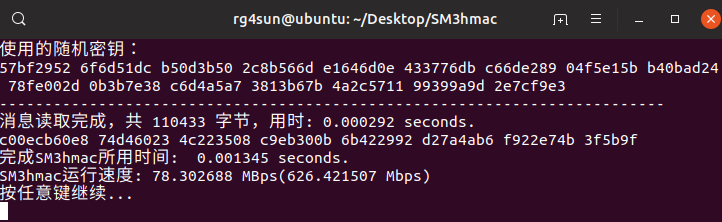

# SM3hmac快速上手
## 1. 作品内容简介

本作品致力于快速实现基于我国政府采用的由国家密码管理局发布的SM3密码散列函数标准的HMAC哈希运算消息认证码。

作品主要包含一个欢迎界面和以下三个功能模块：SM3文档示例、样例测试、自定义。
    
+ 欢迎界面：欢迎用户，引导用户进行功能选择，以及一些使用提示。
  
+ SM3文档示例：校验本程序生成的《SM3密码杂凑算法》标准文档所提供的2个样例的杂凑值，同时给出样例的HMAC值。
  
+ 样例测试：选取1K-100MB八个不同量级的消息文件，计算对应HMAC以及其生成时间和速率。
  
+ 自定义：用户自定义消息输入，对用户输入的消息计算HMAC值。

为了提高程序计算HMAC的性能，减少程序计算用时、提升计算速率，本作品由纯C语言编写完成，并在Linux环境下运行测试。

同时，为了进一步提升程序执行速度，在用C编写相应功能模块时，将SM3的主要几个运算函数均写成宏函数。此外，采取了使用register关键字定义部分变量、拆解小循环for、移位代替乘除法运算、使用复合赋值表达式、把频繁使用的指针型参数拷贝到本地变量、使用并行代码等一系列编写优化方式，以此提升程序运行性能。

测试显示：本程序对消息的HMAC计算基本维持在毫秒级别，计算速率维持在72MBps左右。对10MB以下消息进行HMAC运算基本可以忽略计算延时，对于百KB量级的消息计算速率最佳。

## 2. 作品文件清单

| 文件/文件名 | 作用 |
| :--------: | :--: |
| SampleTest | 存储1K-100MB样例消息文件以及测试结果截图的文件夹 |
| [RandMsgGen.py](./RandMsgGen.py) | 生成足够随机的样例消息文件 |
| [SM3hmac.c](./SM3hmac.c) | 作品主程序 |
| sm3hmac.out | Linux下gcc编译SM3hmac.c生成的可执行文件 |
| [README.md](./README.md) | README文件，作品说明以及使用说明 |
## 3. RandMsgGen.py 使用方法

在 python3.7 环境下，输入python RandMsgGen.py运行此脚本，生成相应规模的随机消息文件，默认生成在SampleTest文件夹，默认的大小是1MB

如需改变生成的文件大小量级，可改变RandMsgGen.py中的chrAmount值，该值用于控制随机生成的消息字符个数

更多细节，请参见 [RandMsgGen.py](./RandMsgGen.py) 源码

## 4. SampleTest 文件夹

SampleTest文件夹存储了由 RandMsgGen.py 形成的 1KB、10KB、50KB、100KB、1MB、10MB、50MB、100MB共计8个量级的测试用例，分别命名为msg1k.txt、msg10k.txt、msg50k.txt、msg100k.txt、msg1M.txt、msg10M.txt、msg50M.txt、msg100M.txt。（注：考虑到txt文件UTF-8编码下的文件头等相关信息的影响，实际生成的文件大小稍有偏差，但仍能满足量级）

**注：由于github普通上传的单个文件大小不能超过50MB，这里没有把msg50M.txt、msg100M.txt上传进去**

同时，此文件夹存储了测试结果数据的截图，例如 [100k文件测试结果截图](./TestSample/测试结果截图/100K/100k1.png)

## 5. SM3hmac.c 文件介绍

该文件是本作品的核心源码，集成了SM3哈希函数的实现、基于SM3的HMAC计算函数的实现以及对以上功能的测试函数。  

该文件在Linux环境下，使用` gcc -o sm3hmac.out SM3hmac.c `命令编译，生成Linux可执行文件sm3hmac.out

## 6. sm3hmac.out 文件

该文件是由 SM3hmac.c 文件编译生成的Linux可执行文件。可以在Linux环境下，进入该文件路径，然后使用 ./sm3hmac.out 命令直接运行。