<p align="center"><font face="宋体" size=5>基于 SM3 算法的 HMAC 快速实现</font></p>

<p align="center">Presented by R.G.</p>

+ [本README更好的排版和阅读体验](https://blog.csdn.net/qq_41709370/article/details/106292047)
+ [更加简要的README(只包含快速上手)](./simpler_README.md)

**如不想阅读详细实现原理，请直接阅 *读SM3hmac快速上手(使用手册)* 部分**

**注：**

- **本README有少量数学公式需要LaTeX支持，github貌似没有原生支持LaTeX，若您在阅读本README时无法正确显示数学公式，请安装支持LaTeX显示的浏览器插件，我推荐 MathJax Plugin for Github 插件**

- **注：如果你的github无法看到图片的话，请参考我的这篇文章**

  [解决Github无法显示图片以及README无法显示图片](https://blog.csdn.net/qq_41709370/article/details/106282229)

  ## 目录大纲

  **github好像不支持展示md的目录，还有些排版问题，为了更好的阅读体验，建议到[我的CSDN](https://blog.csdn.net/qq_41709370/article/details/106292047)看项目介绍。**

[TOC]

## 作品内容摘要

​	本作品致力于快速实现基于我国政府采用的由国家密码管理局发布的 SM3 密码 散列函数标准的 HMAC 哈希运算消息认证码。

作品主要包含一个欢迎界面和以下三个功能模块:SM3 文档示例、样例测试、 自定义。

+ 欢迎界面:欢迎用户，引导用户进行功能选择，以及一些使用提示。

+ SM3 文档示例:校验本程序生成的《SM3 密码杂凑算法》标准文档所提供的2 个样例的杂凑值，同时给出样例的 HMAC 值。

+ 样例测试:选取1K-100MB八个不同量级的消息文件，计算对应HMAC以及其生成时间和速率。

+ 自定义:用户自定义消息输入，对用户输入的消息计算HMAC值。

  为了提高程序计算 HMAC 的性能，减少程序计算用时、提升计算速率，本作品 由纯 C 语言编写完成，并在 Linux 环境下运行测试。

​    同时，为了进一步提升程序执行速度，在用 C 编写相应功能模块时，将 SM3 的 主要几个运算函数均写成宏函数。此外，采取了使用 register 关键字定义部分变量、 拆解小循环 for、移位代替乘除法运算、使用复合赋值表达式、把频繁使用的指针 型参数拷贝到本地变量、使用并行代码等一系列编写优化方式，以此提升程序运行 性能。

​    测试显示:  本程序对消息的HMAC计算基本维持在毫秒级别，计算速率维持在 72MBps左右。对10MB以下消息进行HMAC运算基本可以忽略计算延时，对于百KB量级 的消息计算速率最佳。

**关键词：**HMAC、SM3、哈希摘要、消息验证码、快速实现


## 作品功能与性能说明

**作品设计目标：**快速实现基于 SM3 哈希函数的 HMAC 哈希运算消息认证码

**作品内容及其作用:** 

| 文件/文件夹名 |                        作用                        |
| :-----------: | :------------------------------------------------: |
|  SampleTest   | 存储 1K-100MB 样例消息文件以及测试结果截图的文件夹 |
| RandMsgGen.py |             生成足够随机的样例消息文件             |
|   SM3hmac.c   |                     作品主程序                     |
|  sm3hmac.out  |    Linux 下 gcc 编译 SM3hmac.c 生成的可执行文件    |
|   README.md   |         README 文件，作品说明以及使用说明          |

**作品功能:**作品程序 SM3hmac 主要包含一个欢迎界面和以下三个功能模块: SM3 文档示例、样例测试、自定义。

+ 欢迎界面:欢迎用户，引导用户进行功能选择，以及一些使用提示。
+ SM3 文档示例:校验本程序生成的《SM3 密码杂凑算法》标准文档所提供的 2 个样例的杂凑值，同时给出样例的 HMAC 值。
+ 样例测试:选取 1K-100MB 八个不同量级的消息文件，计算对应 HMAC 以及其生成时间和速率。
+ 自定义:用户自定义消息输入，对用户输入的消息计算 HMAC 值。

**下面是作品主要功能模块的框架图:**

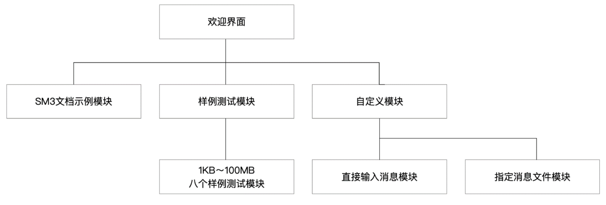

**作品性能:**通过对 1KB-100MB 共计 8 个样例消息文件的测试，得出测试数据与相应分析图。由测试结果可知，本程序对消息的 HMAC 计算基本维持在毫秒级 别，计算速率维持在 72MBps 左右。对 10MB 以下消息进行 HMAC 运算基本可以忽 略计算延时，对于百 KB 量级的消息计算速率最佳。


## 设计原理与实现方案

### SM3 算法流程图

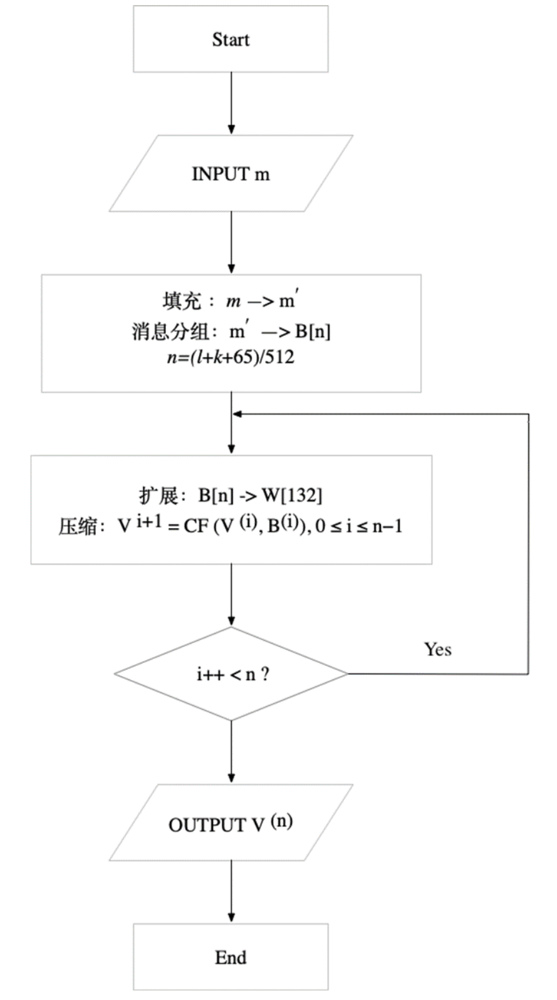

### SM3 算法描述

1. **初始值**

   + `IV =7380166f 4914b2b9 172442d7 da8a0600 a96f30bc 163138aa e38dee4d b0fb0e4e`

2. **常量**
   $$
   T_{j}=\left\{\begin{array}{ll}79 c c 4519 & 0 \leq j \leq 15 \\ 7 a 879 d 8 a & 16 \leq j \leq 63\end{array}\right.
   $$

3. **布尔函数**
   $$
   \begin{array}{l}F F_{j}(X, Y, Z)=\left\{\begin{array}{ll}X \oplus Y \oplus Z & 0 \leq j \leq 15 \\ (X \wedge Y) \vee(X \wedge Z) \vee(Y \wedge Z) & 16 \leq j \leq 63\end{array}\right. \\ G G_{j}(X, Y, Z)=\left\{\begin{array}{ll}X \oplus Y \oplus Z & 0 \leq j \leq 15 \\ (X \wedge Y) \vee(\neg X \wedge Z) & 16 \leq j \leq 63\end{array}\right.\end{array}
   $$
   式中 X,Y,Z为字。

4. **置换函数**
   $$
   \begin{array}{l}P_{0}(X)=X \oplus(X \lll 9) \oplus(X \lll 17) \\ P_{1}(X)=X \oplus(X \lll 15) \oplus(X \lll 23)\end{array}
   $$
   式中X为字。

5. **算法概述**

   对长度为L ($L < 2^{64}$) 比特的消息m，SM3杂凑算法经过填充和迭代压缩，生成杂凑值，杂凑值长度为256比特。

6. **填充**

   + 假设消息 m 的长度为 L 比特。首先将比特“1”添加到消息的末尾，再添加 k 个“0”，k 是满足` L + 1 + k ≡ 448 mod 512 `的最小的非负整数。然后再 加一个 64 位比特串，该比特串是长度 L 的二进制表示。填充后的消息 m′ 的 比特长度为 512 的倍数。

     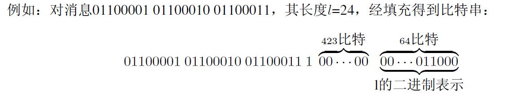

7. **迭代压缩**

   + **迭代过程:**

     将填充后的消息 m′ 按 512 比特进行分组: `m′ = B(0)B(1)...B(n−1) `其中` n=(l+k+65)/512`。

     对 m′按下列方式迭代:

     ```python
     FOR i=0 TO n-1
     	V(i+1) =CF(V(i),B(i)) 
     ENDFOR
     ```

     其中 CF 是压缩函数，V (0) 为 256 比特初始值 IV，B(i)为填充后的消息分组， 迭代压缩的结果 为 V (n)。

   + **消息扩展:**

     将消息分组 B(i)按以下方法扩展生成 132 个字` W0, W1,..., W67, W0′,W1′,... , W‘63`，用于压缩函数 CF:

     + 将消息分组 B(i)划分为 16 个字 W0, W1,..., W15。

     + ```python
       FOR j=16 TO 67
       	Wj ← P1(Wj−16 ⊕Wj−9 ⊕(Wj−3 ≪ 15))⊕(Wj−13 ≪ 7)⊕Wj−6 
       ENDFOR
       ```

     + ```
       FOR j=0 TO 63 
       	Wj′= Wj ⊕Wj+4
       ENDFOR
       
       ```

       

   + **压缩函数：**

     + 令 A,B,C,D,E,F,G,H 为字寄存器,SS1,SS2,TT1,TT2 为中间变量,压缩函数 V i+1=CF (V (i), B(i))， 0 ≤ i ≤ n−1。计算过程描述如下:

       ```python
       ABCDEFGH ← V (i)
       FOR j=0 TO 63 
       	SS1←((A≪12)+E+(T_j ≪j))≪7
         SS2 ← SS1⊕(A ≪ 12)
       	TT1 ← FF_j (A, B, C) + D + SS2 + Wj′ 
         TT2 ← GG_j (E, F, G) + H + SS1 + Wj
       	D←C C←B≪9 B←A A←TT1 H←G
       	G ← F ≪ 19 F←E
       	E ← P0(TT2)
       ENDFOR
       V(i+1) ←ABCDEFGH⊕V(i)
       ```

       其中，≪为循环左移，字的存储为大端(big-endian)格式

8. **杂凑值**

   ```python
   ABCDEFGH ← V (n)
   ```

   输出 256 比特的杂凑值 y = ABCDEFGH


### HMAC 算法流程图

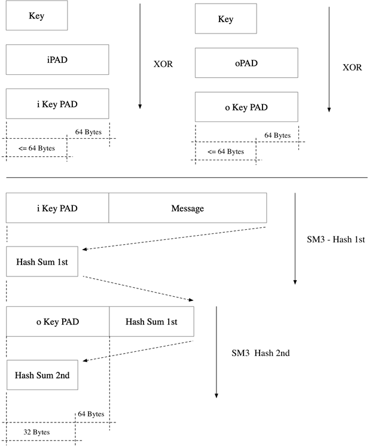

### HMAC 算法描述

在 HMAC 的定义中用到一个密码散列函数和一个密钥 Key。本作品使用的 SM3 作 为对明文进行分组循环压缩的散列函数，明文分组长度为 64(byte)，散列函 数的输出长度为 32(byte)。认证密钥 K 为随机生成。

再定义两个不同的固定字符串 iPad 和 oPad 如下(“i”和“o”表示内部和外 部):

+ iPad=一个字节(byte)的 0x36 重复 64 次;
+ oPad=一个字节(byte)的 0x5C 重复 64 次

操作步骤如下:

1. 在密钥 K 后面填充 0，使其成为长度为 64byte 的字符串。 
2. 用第一步得到的 64byte 的字符串与 iPad 作按位异或; 
3. 将消息 Message 附加到第二步产生的 64byte 字符串后面; 
4. 对第三步产生的数据流用散列函数 SM3 计算消息摘要;
5.  用第一步得到的 64byte 的字符串与 oPad 作按位异或;
6.  将第四步生成的消息摘要附加到第五步的 64byte 字符串之后; 
7. 对第六步产生的数据流用散列函数 SM3 计算消息摘要，作为输出

以输入 Message 为例，作如下操作:
` H(K XOR oPad，H(K XOR iPad，Message))`

其中 H() 为哈希函数，也就是我们上面的SM3

### 具体代码实现

参见：https://github.com/RGNil/RG_SM3hmac

## SM3hmac快速上手(使用手册)

### RandMsgGen.py 使用方法

在 python3.7 环境下，输入python RandMsgGen.py运行此脚本，生成相应规模的随机消息文件，默认生成在SampleTest文件夹，默认的大小是1MB

如需改变生成的文件大小量级，可改变RandMsgGen.py中的chrAmount值，该值用于控制随机生成的消息字符个数

更多细节，请参见 [RandMsgGen.py](./RandMsgGen.py) 源码

###  SampleTest 文件夹

SampleTest文件夹存储了由 RandMsgGen.py 形成的 1KB、10KB、50KB、100KB、1MB、10MB、50MB、100MB共计8个量级的测试用例，分别命名为msg1k.txt、msg10k.txt、msg50k.txt、msg100k.txt、msg1M.txt、msg10M.txt、msg50M.txt、msg100M.txt。（注：考虑到txt文件UTF-8编码下的文件头等相关信息的影响，实际生成的文件大小稍有偏差，但仍能满足量级）

**注：由于github普通上传的单个文件大小不能超过50MB，这里没有把msg50M.txt、msg100M.txt上传进去**

同时，此文件夹存储了测试结果数据的截图，例如 [100k文件测试结果截图](./TestSample/测试结果截图/100K/100k1.png)


### SM3hmac.c 文件介绍（项目主体代码）

该文件是本作品的核心源码，集成了SM3哈希函数的实现、基于SM3的HMAC计算函数的实现以及对以上功能的测试函数。  

该文件在Linux环境下，使用` gcc -o sm3hmac.out SM3hmac.c `命令编译，生成Linux可执行文件sm3hmac.out

### sm3hmac.out 文件

该文件是由 SM3hmac.c 文件编译生成的Linux可执行文件。可以在Linux环境下，进入该文件路径，然后使用 ./sm3hmac.out 命令直接运行。

### 运行与测试环境

程序源码SM3hmac.c由纯C语言编写完成，在Windows 10下的VMware Workstation Pro 15的虚拟Ubuntu19.0.4下运行。通过Gcc编译成Linux可执行文件sm3hmac.out执行以下测试。

## 运行结果(代码性能见*系统测试与结果*)

校验本程序生成的《SM3 密码杂凑算法》标准文档所提供的 2 个样例的杂凑 值，同时给出样例的 HMAC 值:

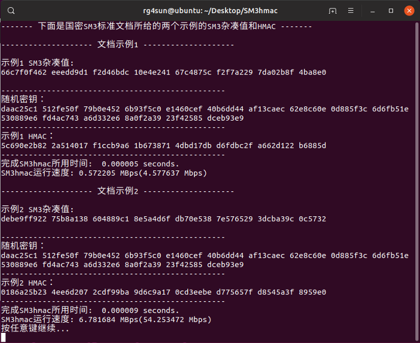

100MB 量级的消息文件其对应 HMAC 以及其生成时间和速率的测试运行结果:

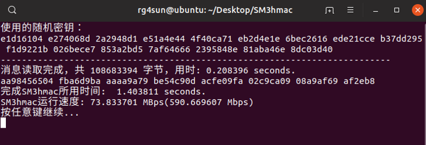

对用户选择消息文件进行HMAC计算：


## 技术指标

​    本作品实现基于我国政府采用的由国家密码管理局发布的SM3密码散列函数标准的HMAC哈希运算消息认证码。

   Hash函数部分完全根据国家密码管理局发布的《SM3密码杂凑算法》标准文档编写完成，同时对标准所给出的示例做了校验测试，本程序对标准所提供的示例消息计算出的杂凑值与标准杂凑值相同。

  此外，本程序采用的HMAC算法完全依据RFC2104标准实现，并对样例测试结果值进行了正确性验证。验证方法是：利用Go语言现有的crypto/hmac库，以及 苏州同济区块链研究院有限公司 的基于Go语言的国密SM3算法库，两者结合运算得到HMAC值，验证本程序对相同样例消息的计算结果。

  对于程序计算HMAC值的性能评价，采用计算用时（单位：s）、计算速率（MBps）两个指标来衡量。

  测试样例选取多种大小不同的消息文件进行读取与哈希运算，对消息的HMAC计算基本维持在毫秒级别，计算速率维持在72MBps左右。

  详细分析见系统测试部分。

## 系统测试与结果

### 测试方案

本程序的测试主要分为两部分：第一部分，测试SM3的Hash函数是否能生成正确杂凑值；第二部分，测试样例消息文档生成的HMAC是否正确，同时测试其生成时间以及速度。

第一部分的测试，根据国家密码管理局发布的《SM3密码杂凑算法》标准文档所提供的2个样例，计算所生成的杂凑值是否和标准所给的杂凑值相同，相同则说明本程序的Hash函数部分准确无误。

第二部分的测试，要求所选用的消息具有一定随机性，且能满足绝大部分场景的消息使用。因此，采用了如下方法进行测试。

考虑到系统的普适性与兼容性，本次测试从Unicode字符集中挑选部分常用的字符形成测试字符集。选取的测试字符以及整体测试字符集如下：

<p align="center">测试用例字符集</p>

|       字符集名称       | Unicode编码范围（16进制） | 字符集大小（字符个数） |
| :--------------------: | :-----------------------: | :--------------------: |
|     基本拉丁字母集     |         0020-007F         |           95           |
|     国际音标扩展集     |         0250-02AF         |           95           |
| 希腊字母及科普特字母集 |         0370-03FF         |          143           |
|       常用标点集       |         2000-206F         |          111           |
|       货币符号集       |         20A0-20CF         |           47           |
|       数字形式集       |         2150-218F         |           63           |
|      数学运算符集      |         2200-22FF         |          255           |
|     杂项工业符号集     |         2300-23FF         |          255           |
| 带圈或括号的字母数字集 |         2460-24FF         |          159           |
|        制表符集        |         2500-257F         |          127           |
|       印刷符号集       |         2700-27BF         |          191           |
|     杂项数学符号集     |         27C0-27eF         |           47           |
|    中日韩相关字符集    |         31C0-9FFF         |         28223          |

根据选定的测试字符集，采用python的random库，随机从测试字符集中选取字符，形成1KB、10KB、50KB、100KB、1MB、10MB、50MB、100MB共计8个量级的测试用例，分别命名为msg1k.txt、msg10k.txt、msg50k.txt、msg100k.txt、msg1M.txt、msg10M.txt、msg50M.txt、msg100M.txt。（注：考虑到txt文件UTF-8编码下的文件头等相关信息的影响，实际生成的文件大小稍有偏差，但仍能满足量级）

具体如何生成测试样例，请参见作品中的RandMsgGen.py文件，所有的测试样例都由该文件生成，且测试样例足够随机，包含常用的字母、数字、中文以及一些特殊字符。下面是部分msg1M.txt的截图：

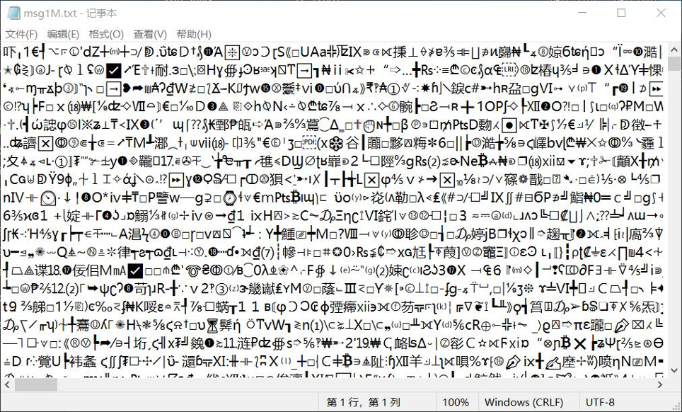

用生成的8个不同量级大小的随机txt文本，作为消息的模拟，以此作为程序的消息输入，运算消息的HMAC值，并调用C库函数clock()计算HMAC生成时间以及速率。

为了确定所生成的HMAC值是否正确，我们搜寻了已有的资源，决定使用Go语言现有的crypto/hmac库，以及 *苏州同济区块链研究院有限公司* 的基于Go语言的国密SM3算法库，两者结合运算得到HMAC值，作为本程序结果正确性的辅助验证。

### 功能测试

本节主要对作品程序的三大功能模块进行了功能完整性测试。

SM3hmac主要包含一个欢迎界面和以下三个功能模块：SM3文档示例、样例测试、自定义。

- 欢迎界面：欢迎用户，引导用户进行功能选择，以及一些使用提示。
- SM3文档示例：校验本程序生成的《SM3密码杂凑算法》标准文档所提供的2个样例的杂凑值，同时给出样例的HMAC值。
- 样例测试：选取1K-100MB八个不同量级的消息文件，计算对应HMAC以及其生成时间和速率。
- 自定义：用户自定义消息输入，对用户输入的消息计算HMAC值。

下面是以上所列举的功能的完整性测试：

1.  欢迎界面呈现

   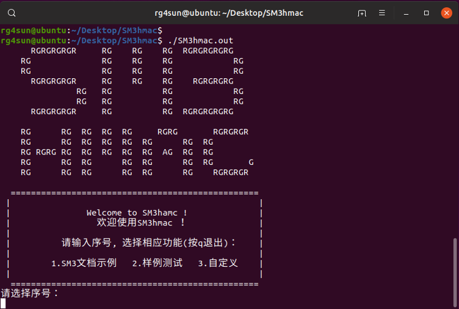

   

2. SM3文档示例

   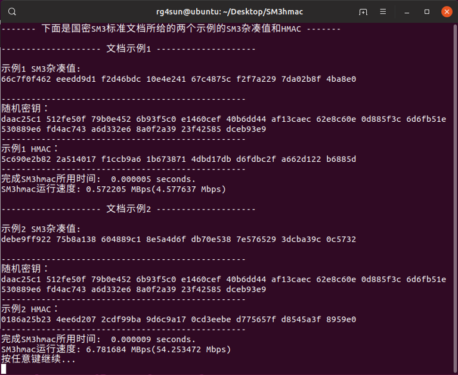

   对比国家密码管理局发布的《SM3密码杂凑算法》标准文档所提供的2个样例可知，计算所生成的杂凑值和标准所给的杂凑值相同。

3. 样例测试

   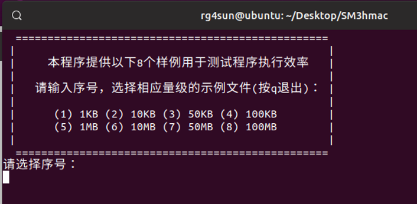

   以下是50KB和1MB的运行测试:

   50KB样例运行结果:

   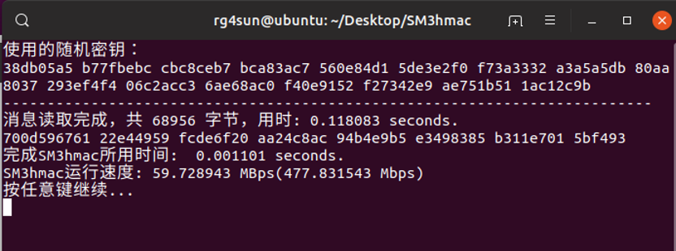

   利用Go库生成的50KB样例文件的HMAC:

   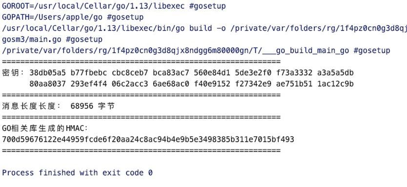

   可见，本程序运算所得结果与调用Go库运算结果一致

   1MB样例运行结果:

   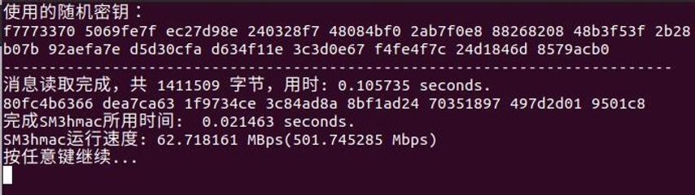

   利用Go库生成的1MB样例文件的HMAC:

   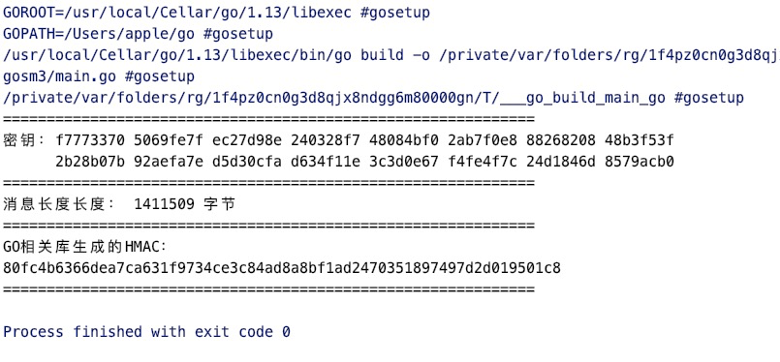

   可见，本程序运算所得结果与调用Go库运算结果一致

   其余6个量级的文档测试均和Go运算结果一致，此处略去截图

4. 自定义:

   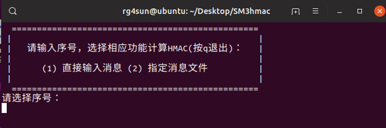

   直接输入消息测试:

   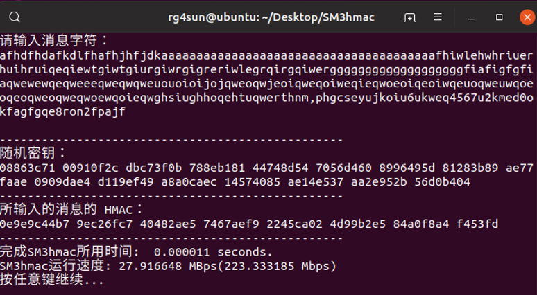

   指定消息文件测试:

   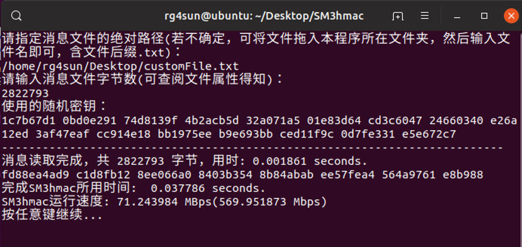

### 性能测试

本节是程序的性能测试，本程序主要关注于快速实现基于我国政府采用的由国家密码管理局发布的SM3密码散列函数标准的HMAC哈希运算消息认证码。对于程序的性能，我们采用程序计算HMAC所消耗的时间以及相应速率作为衡量指标。

考虑到测试的有效性以及真实性，我们将给出测试所用平台的相应软硬件配置。此外，为了力求测试结果的准确性，我们采取了一下方法：

- 多个不同量级的文件测试程序在面对不同大小的消息时的运算性能
- 随机化测试文件的内容，保证消息内容不具规律性
- 每个量级文件采取多组测试，求平均时间以及速率作为最终性能指标

下面是部分测试截图，详细的测试报告将在 ***测试数据与结果*** 一节呈现

程序源码SM3hmac.c由纯C语言编写完成，在Windows 10下的VMware Workstation Pro 15的虚拟Ubuntu19.0.4下运行。通过Gcc编译成Linux可执行文件sm3hmac.out执行以下测试。

1. 测试文件：msg1k.txt  文件量级：1KB

   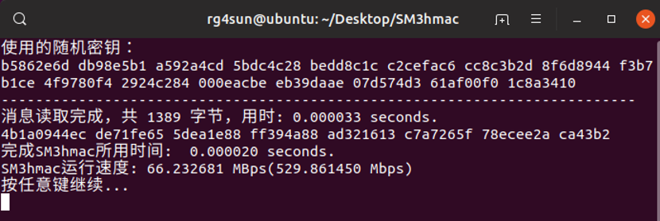

   

2. 测试文件：msg10k.txt  文件量级：10KB

   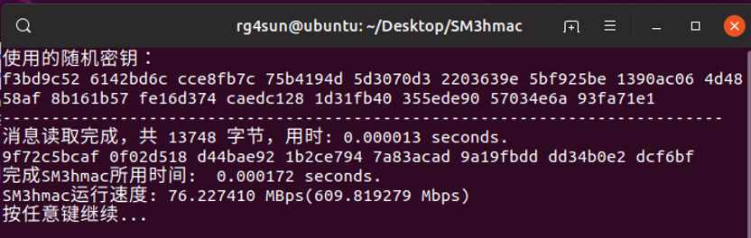

   

3. 测试文件：msg100k.txt  文件量级：100KB

   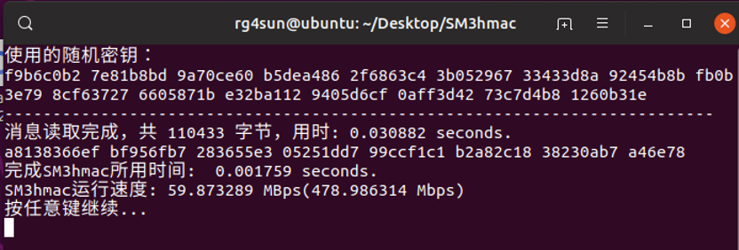

   

4. 测试文件：msg10M.txt  文件量级：10MB

   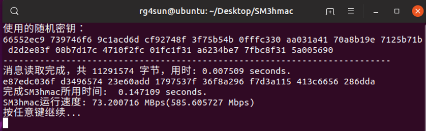

   

5. 测试文件：msg100M.txt  文件量级：100MB

   


### 测试数据与结果

下面是1K-100MB共计8个消息样例的测试结果，每个样例分别代表一个数量级的消息大小，为了消除测试数据的偶然性，提高测试数据准确性，对每个消息量级各测5组数据，最后求出平均值，得到平均计算用时和平均计算速率两个指标。

以下是测试数据详情（所有测试数据的截图可在作品文件清单的SampleTest文件夹的测试结果截图文件夹中）：

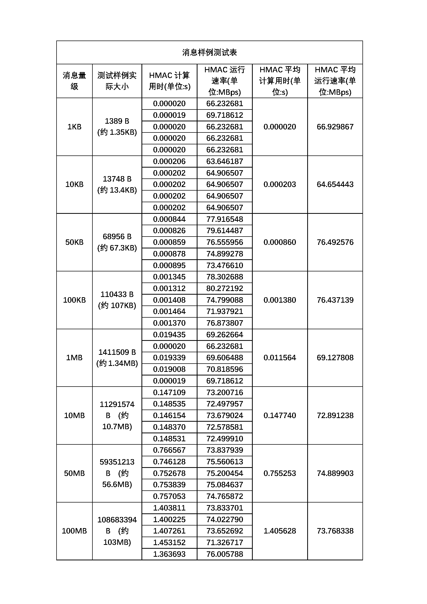

测试数据分析图：

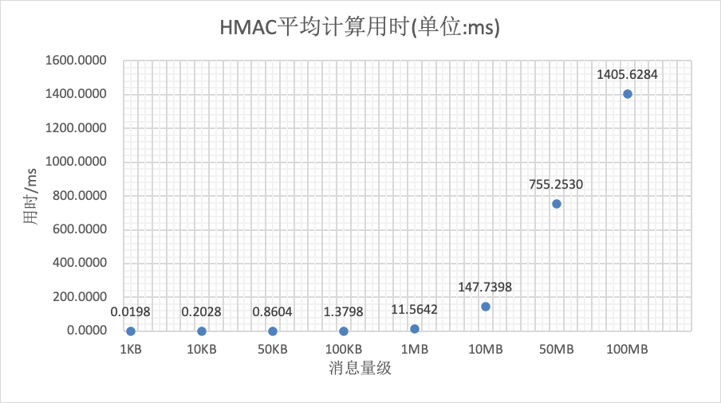

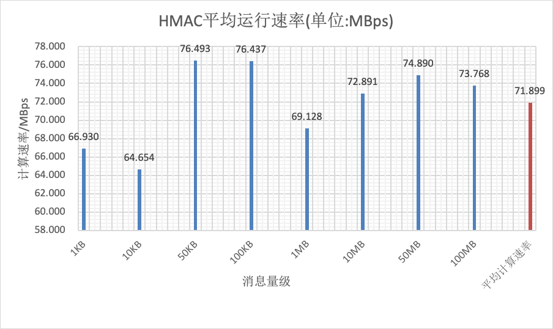

由以上测试数据与相应分析图可知，本程序对消息的HMAC计算基本维持在毫秒级别，计算速率维持在72MBps左右。对10MB以下消息进行HMAC运算基本可以忽略计算延时，对于百KB量级的消息计算速率最佳。

鉴于在网络环境下，一次性传输消息的量级很少达到10MB，超过10MB可以采取分组计算的方式，本程序的性能还是极其可观的。

## 应用前景

### **登录身份认证:**

当客户端向服务器发送请求时，黑客可以截获客户端发送的数据。在许多场合，如：网上购物、应用登录等，发送的请求中会包含用户密码、银行卡密码等私人敏感信息，严重威胁到了用户的隐私、财产安全。HMAC哈希消息验证码，通过对用户发送数据进行HMAC运算后再发送请求的方式，防止数据暴露。

HMAC登录身份认证流程如下：

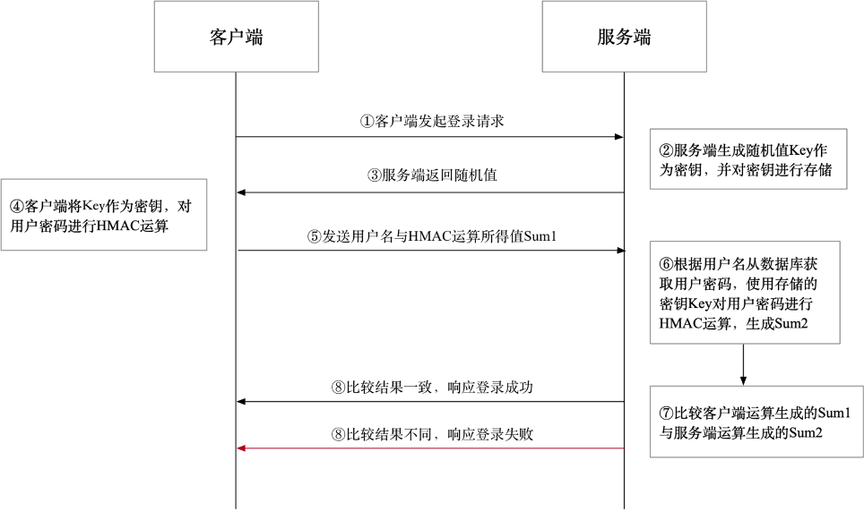

①客户端向服务端发送登录请求。

②服务端返回一个随机数作为密钥，并在会话记录中保存这个随机值。

③客户端先使用密钥对用户私密信息进行HMAC运算，再将数据发送给服务器。

④服务器读取数据库中对应用户的密码，使用存储的随机值（密钥）对从数据库中获取的密码进行相同的HMAC运算。

⑤服务器比较客户端HMAC运算生成值与服务器HMAC运算生成值，如果匹配成功则返回成功响应，否则返回失败响应。

## 项目总结

本作品以C语言实现的SM3为基础，进而实现HMAC哈希认证的快速实现，由于主题对交互与应用没有明确要求，故所有操作以快速实现为主要目的。快速实现主要包括对SM3算法中的操作的宏定义、减少函数调用，以增加适当的空间复杂度来降低时间复杂度等。此外，采取了使用register关键字定义部分变量、拆解小循环for、移位代替乘除法运算、使用复合赋值表达式、把频繁使用的指针型参数拷贝到本地变量、使用并行代码等一系列编写优化方式，进一步提升程序运行性能。

测试样例选取多种大小不同的文件进行读取与哈希运算，对消息的HMAC计算基本维持在毫秒级别，计算速率维持在72MBps左右。对10MB以下消息进行HMAC运算基本可以忽略计算延时，对于百KB量级的消息计算速率最佳。

初步预设的应用场景为涉及身份认证、用户登录等方面，通过服务器端生成随机salt，在服务器端与客户端分别对用户的key进行HMAC运算操作，对运算结果进行比对从而确认用户身份。


